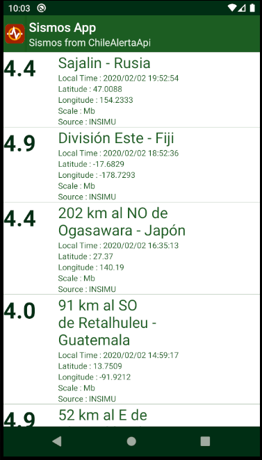

# SismosApp
> App to obtain earthquake information 

## Student Name 
 Eduardo Alvarez S.

## Table of contents
* [General info](#general-info)
* [Screenshots](#screenshots)
* [Features](#features)
* [Technologies](#technologies)
* [Status](#status)
* [Contact](#contact)

## General info
Project created with the purpose of learn how to create a android app, using an API ChileAlerta
(https://github.com/TBMSP/ChileAlertaApi)and practice our codding skills.

## Screenshots

## Features
Night Mode 🌗

## Technologies
-JAVA 8 
-Gradle 
-Retrofit 

## Status
Project is: _in progress_.

## Contact
Created by Eduardo Alvarez S. (https://github.com/edoxazul) - feel free to contact me!
